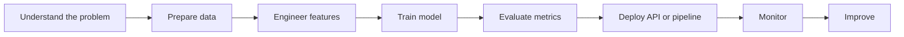

<!--
  Profile README for GitHub user: devchuz
  Tip: Create a public repository named exactly `devchuz` and place this file as README.md
-->

<div align="center">


<p>
  <a href="https://github.com/devchuz">
    
  </a>
  <a href="mailto:jhonrinconroman@gmail.com">
    
  </a>
</p>


</div>

---

## `whoami`

```yaml
name: Jhon Rincon Roman
alias: devchuz
role: Machine Learning Engineer
background: Physics Engineering
main_language: Python
also_working_with: [C++, Go]
focus: [Machine Learning, MLOps, Data Engineering, Cloud, Backend APIs]
style: practical, curious, technical, a little bit chacotero
```

I enjoy building systems where **data, machine learning, software engineering and cloud infrastructure** work together.

Currently, I focus on creating practical ML solutions: from data pipelines and feature engineering to model training, evaluation, deployment and monitoring.

---

## Tech I use

<div align="center">

### Languages


### Machine Learning & Data


<br />


### Backend, MLOps & Cloud


<br />


</div>

---

## What I build

<table>
  <tr>
    <td width="50%">
      <h3>ML & Forecasting</h3>
      <ul>
        <li>Forecasting and prediction models</li>
        <li>Feature engineering pipelines</li>
        <li>Model evaluation with business metrics</li>
        <li>Experiment tracking and model comparison</li>
      </ul>
    </td>
    <td width="50%">
      <h3>MLOps & Cloud</h3>
      <ul>
        <li>Training and serving workflows</li>
        <li>Model APIs with FastAPI</li>
        <li>Dockerized services</li>
        <li>Cloud deployments on AWS</li>
      </ul>
    </td>
  </tr>
  <tr>
    <td width="50%">
      <h3>Data Engineering</h3>
      <ul>
        <li>ETL and data processing</li>
        <li>Python, Spark, Pandas and Polars</li>
        <li>Data quality and validation</li>
        <li>Cloud data workflows</li>
      </ul>
    </td>
    <td width="50%">
      <h3>Software Engineering</h3>
      <ul>
        <li>Backend APIs</li>
        <li>Automation scripts</li>
        <li>CI/CD with GitHub Actions</li>
        <li>Performance-oriented code with C++ and Go</li>
      </ul>
    </td>
  </tr>
</table>

---

## Current direction

```txt
Building reliable ML systems, not just models.
```

I am especially interested in:

- MLOps at scale
- Forecasting systems
- Model monitoring
- Data pipelines
- Cloud-native ML deployment
- Backend engineering for ML products
- Performance and systems programming with C++ and Go

---

## My workflow



---

## GitHub analytics

<div align="center">


<br />
<br />


<br />
<br />


</div>

---

## Featured mindset

<div align="center">

| Build | Learn | Ship | Improve |
|------:|:------|:-----|:--------|
| Turn ideas into systems | Keep the fundamentals strong | Deliver useful solutions | Measure and iterate |

</div>

---

<div align="center">

### Thanks for visiting 👋


</div>
